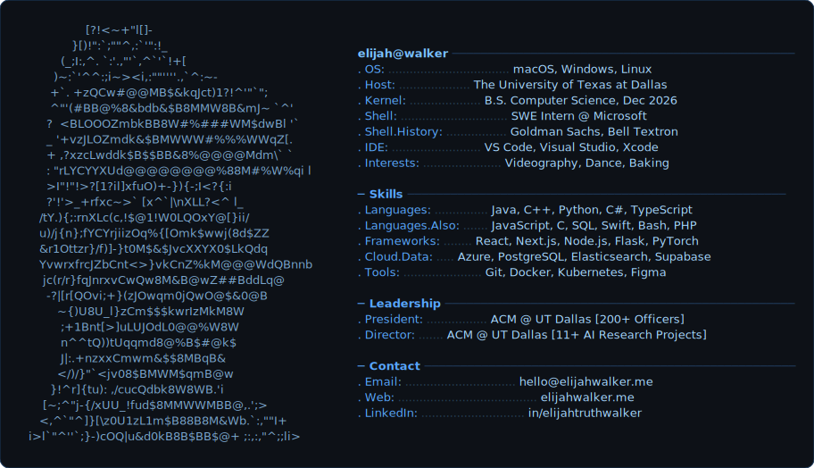

<picture>
  <source media="(prefers-color-scheme: dark)" srcset="profile-dark.svg">
  <source media="(prefers-color-scheme: light)" srcset="profile-light.svg">
  
</picture>

<!--
The ASCII portrait + info panel above is generated by generator/build_profile.py:
it lifts the subject out of a headshot (macOS Vision), maps luminance onto a
character ramp (inverted for dark mode, normal for light mode), and lays the
result out as themed SVGs. To tweak the panel text or regenerate:

    python3 generator/build_profile.py
-->
